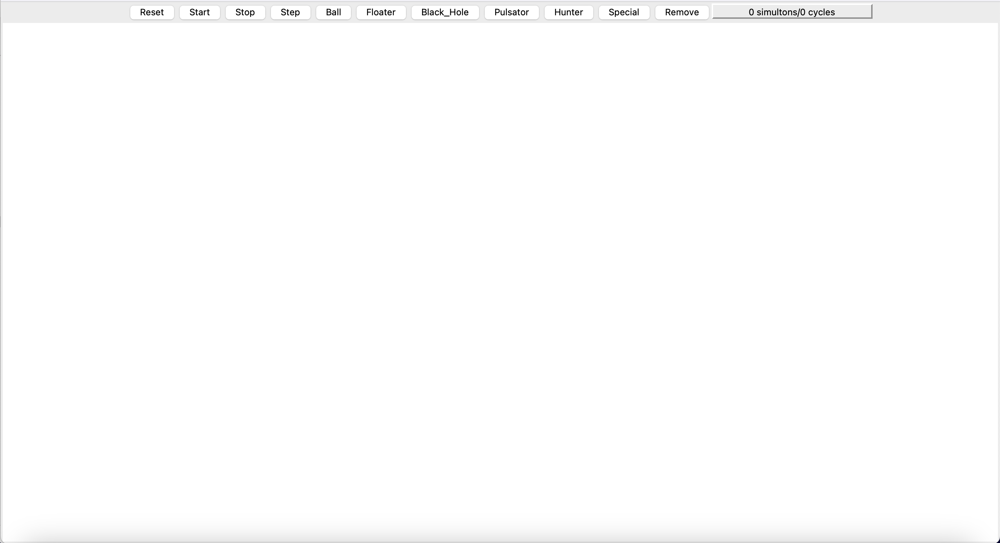
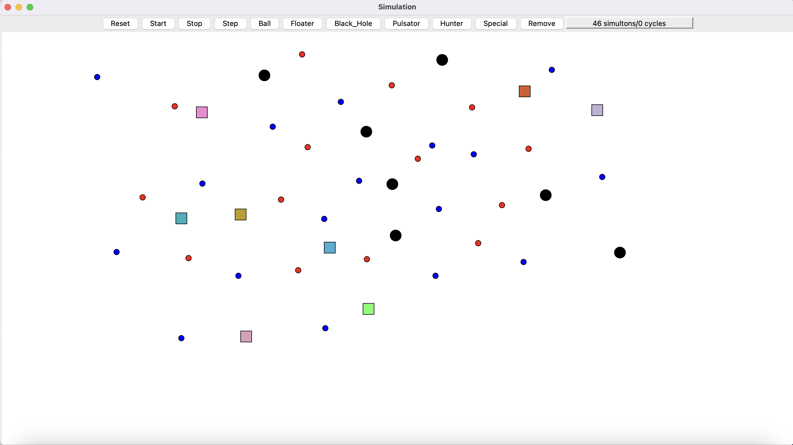
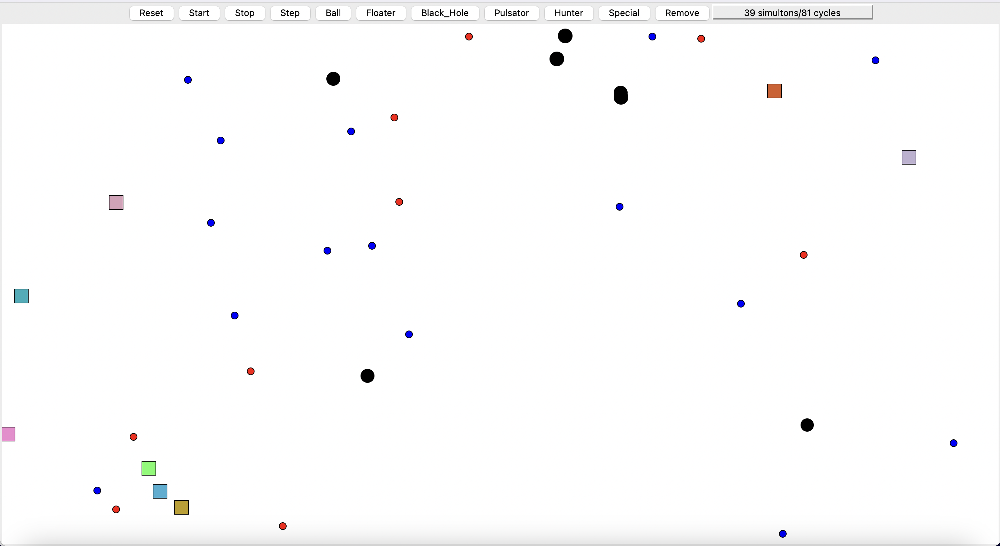

# Hunter_Prey_Simulation
Hunter and Prey Simulation

Allows a user to place different simulation objects into the simulation see how they act.

1. Balls pick a random direction in travel in that direction at a constant speed.
2. Floaters randomly change their direction and speed by a small theta and travel in that direction.
3. Black Holes stay at a fixed position and destroy any balls or floaters that come near it.
4. Pulsators are black holes that shrink or grow in size with respect to when they absorb a prey.
5. Hunters are Pulsators that are aware of Prey locations and chase them to absorb them.
6. Special is a special Prey that is aware of the hunter and avoids them by travelling in a different direction.

Users can Start or Stop the simulation at any given moment and click Step to progress the simulation by one cycle.

